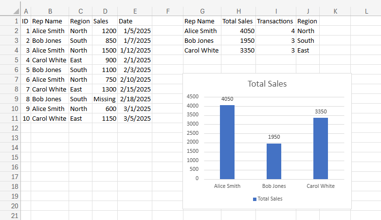

# Excel Sales Data Cleaning & Summary Report

## Overview
A business provided messy sales rep data with inconsistent capitalization,
extra spaces, and missing values. I cleaned the data and produced a summary
report with total sales and transaction counts per representative.

## Problems Fixed
- Inconsistent name and region capitalization
- Extra spaces in text cells
- Missing sales values flagged clearly

## Tools Used
Excel — TRIM, PROPER, IF, SUMIF, COUNTIF, VLOOKUP, IFERROR

## Output
A two-sheet workbook — raw data preserved on one sheet, cleaned report
with summary table and bar chart on the other.
